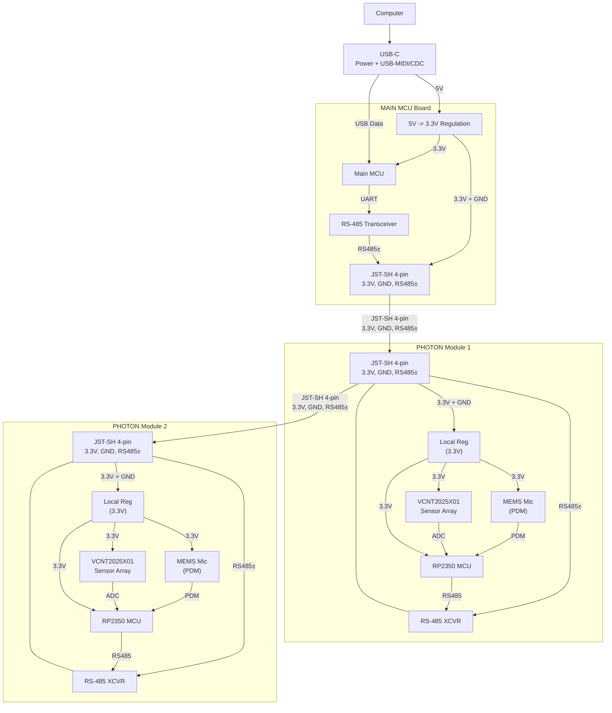
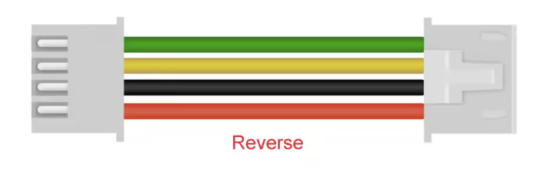

# PHOTON  
**PHysical Optical Tracking of Notes system**  
PHOTON is designed to make high-speed, contactless key tracking accessible for researchers, instrument builders, and tinkerers—without requiring custom hardware for every experiment.

## Overview

**PHOTON** is an open-source, modular optical sensing platform for high-resolution key and motion tracking. Each module integrates a KiCad-designed linear array of **VCNT2025X01 reflective sensors** with a Raspberry Pi **RP2350** microcontroller for fast, flexible data capture.

Modules can operate as **standalone USB-C devices**—streaming MIDI or raw sensor data—or link together in a **daisy-chained network** to form larger sensing surfaces. Firmware is written in **[CircuitPython](https://circuitpython.org)**. 
### Key Features  
**Hardware**
- Linear array of [VCNT2025X01](https://www.vishay.com/en/product/84895/) reflective sensors  
- [RP2350](https://www.raspberrypi.com/products/rp2350/) dual-core MCU with native USB 2.0  
- USB-C for power, data, and MIDI  
- ESD-protected power and I/O  
- Low Profile Design
- Low power consumption less than 0.5W (100mA @ 5V) per sensor board. 

**Connectivity**
- [QWIIC / I²C expansion](https://www.sparkfun.com/qwiic) for peripherals and chaining  
- UART-based RS485 daisy-chain interface for multi-module systems. Error-free high-speed communication across several meters.
- Enumerates as a USB-MIDI or USB-CDC device on any host  

**Openness**
- Firmware in [CircuitPython](https://circuitpython.org) (simple to modify and re-flash)  
- Fully open hardware (KiCad 9) and open firmware  

### Use Cases
PHOTON enables **contactless, high-resolution sensing** for musical instruments, robotics, laboratory setups, and other motion-tracking applications.

The device can function as a high resolution distance measurement of a single sensor at 2.5kHz or a full 64-sensor scan at 100Hz. This allows ample room to conduct high resolution key movement studies. Custom MIDI interfaces can be developed for various instruments in a non-invasive way and the CircuitPython code means that the mechanisms are fully controllable by the user. This is in contrast to a typical MIDI keyboard which uses two switches and therefore no changable strike point.

---

## Architecture  

### Hardware

Each PHOTON module contains:  
- A **linear VCNT2025X01 reflective sensor array**  
- An **RP2350** microcontroller with onboard flash (8MB)
- **USB-C** (for firmware update) and 4-pin **JST-SH** connectors for RS-485 
- Onboard regulation from **5 V → 3.3 V**  

#### Sensor Array  
A Ki-Cad 9 Plugin is provided to create a sensor board that is both manufacturable and appropriate for the user. This plugin allows the user to define the "pitch" (inter-center distance) of each sensing point, and the number of sensors. Moreover, as it is typical to have a sensing surface that requires an odd-number of sensors, a perforated "last sensor" area is available for removal after manufacturing.  **Note**: All designs must be verified before ordering.

Each sensor is connected to an enable line, via an N-FET transistor. This way, it only uses power when it is being sampled. Moreover, the sensor is sampled using the internal ADC on the RP2350 chip, allowing a very small power consumption. By sampling with the internal ADC, a significant amount of precision can be read from a small travel distance.

  ##### Reflective Sensing Principle  

The VCNT2025X01 emits infrared light toward a moving surface (e.g., a piano key). The reflected intensity, sampled by the ADC, provides a continuous estimate of position at rates up to ~100 Hz. The RP2350 processes these signals and outputs MIDI or control data over USB.

#### Technology Stack  
- **Optical sensing:** VCNT2025X01  
- **MCU:** RP2350 (dual-core Cortex-M33)  
- **Audio:** TDK T3902 MEMS microphone ([datasheet](https://invensense.tdk.com/products/digital/t3902/))  
- **Firmware:** CircuitPython or C SDK  
- **Mechanical:** 2-layer PCB; ~\$45 per fully assembled board  
- **Inter-board Interface:**: RS-485 enables longer-distance **differential** communication from a master device to many other devices. The bus must be terminated at the end points of the bus. The [TI THVD1424](https://www.ti.com/lit/ds/symlink/thvd1424.pdf?ts=1764579397242) RS485 controller offers a programmable termination resistor that is controllable in the RP2350 firmware. The individual sensor boards also offer solder-bridge (cut-able with a razor blade/xacto knife) jumpers on the far side of the board, so that the stub is terminated to eliminate reflections. 

### Firmware / Software  
- **Signal path:** Samples analog output from each VCNT2025X01 via the RP2350 ADC, processes values in real time, and exports them as MIDI CC messages or raw USB serial data.  
- **Host integration:** Enumerates as a USB-MIDI device compatible with any DAW, Max/MSP patch, or custom Python client.  
- **Protocols:** USB-MIDI (default)
- **Language:** CircuitPython 10.x (RP2350-compatible).  

---

# Hardware Overview

---

## Getting Started  

### Requirements  

**Hardware:**  
- PHOTON module(s)  
- USB-C cable  
- JST-SH 4-Pin Cables, specifically: 1.0mm pitch, 4-PIN, "Reverse/Opposite Direction" heads, which makes Pin 1 of board A always align with Pin 1 of board B. Note: these cables are mechanically and electrically identical to QWIIC cables. 

**Software:**  
- CircuitPython UF2 for RP2350  
- A DAW or MIDI viewer (Pianoteq, Ableton Live, Reaper, Max/MSP, etc.)  

### Build & Flashing  

1. Hold the **USB-BOOT** button and connect the board via USB-C.  
2. Copy the latest CircuitPython `.uf2` for **Raspberry Pi Pico 2** to the mounted drive.  
   - Download from: https://circuitpython.org/board/raspberry_pi_pico2/  
3. After reboot, copy your `code.py` and any libraries directly to the CIRCUITPY drive.  

CircuitPython runs entirely on-device; updating or modifying the firmware is as simple as replacing `code.py`.

### Debugging

Debugging is primarily done over the USB serial REPL.  
Use `print()`-style logging for diagnostics, but be aware that heavy serial output may impact timing performance.

The unpopulated JTAG header can be used for debugging **CircuitPython itself**, but not for stepping through user Python code.

