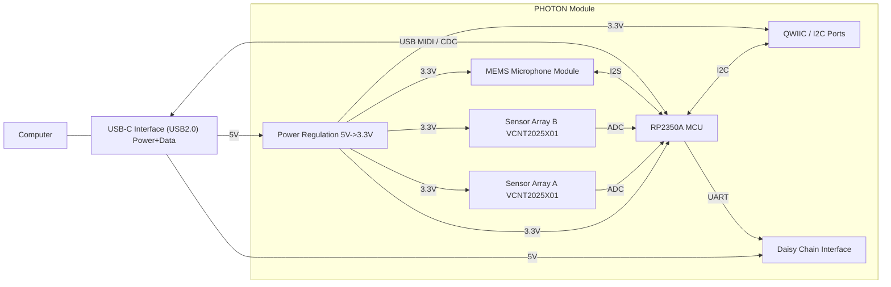

# PHOTON  
**PHysical Optical Tracking of Notes system**  
PHOTON is designed to make high-speed, contactless key tracking accessible for researchers, instrument builders, and tinkerers—without requiring custom hardware for every experiment.

## Overview

**PHOTON** is an open-source, modular optical sensing platform for high-resolution key and motion tracking. Each module integrates a KiCad-designed linear array of **VCNT2025X01 reflective sensors** with a Raspberry Pi **RP2350** microcontroller for fast, flexible data capture.

Modules can operate as **standalone USB-C devices**—streaming MIDI or raw sensor data—or link together in a **daisy-chained network** to form larger sensing surfaces. Firmware is written in **[CircuitPython](https://circuitpython.org)** and supports **[QWIIC](https://www.sparkfun.com/qwiic)** for rapid prototyping and expansion.

### Key Features  
**Hardware**
- Linear array of [VCNT2025X01](https://www.vishay.com/en/product/84895/) reflective sensors  
- [RP2350](https://www.raspberrypi.com/products/rp2350/) dual-core MCU with native USB 2.0  
- USB-C for power, data, and MIDI  
- ESD-protected power and I/O  

**Connectivity**
- [QWIIC / I²C expansion](https://www.sparkfun.com/qwiic) for peripherals and chaining  
- UART-based daisy-chain interface for multi-module systems  
- Enumerates as a USB-MIDI or USB-CDC device on any host  

**Openness**
- Firmware in [CircuitPython](https://circuitpython.org) (simple to modify and re-flash)  
- Fully open hardware (KiCad 9) and open firmware  

### Use Cases
PHOTON enables **contactless, high-resolution sensing** for musical instruments, gesture interfaces, robotics, laboratory setups, and other motion-tracking applications. Its modular approach allows experimentation without fabricating new hardware for each use case.

---

## Architecture  

### Hardware

Each PHOTON module contains:  
- A **linear VCNT2025X01 reflective sensor array**  
- An **RP2350** microcontroller with onboard flash and USB  
- **USB-C** and **QWIIC/I²C** connectors  
- Optional **UART daisy-chaining**  
- Onboard regulation from **5 V → 3.3 V**  

#### Sensor Array Philosophy  
Different instruments require different sensing geometries. Instead of producing a new PCB for every setup, the sensor array **oversamples the physical space**: 64 sensors at ~6.4 mm spacing. Many of these sensors are unused in any given installation, but this guarantees that sensors align exactly where needed.

A built-in **MEMS microphone** provides coarse f₀ estimation, allowing software to correlate acoustic events with the nearest physical motion for system calibration.

#### Technology Stack  
- **Optical sensing:** VCNT2025X01  
- **MCU:** RP2350 (dual-core Cortex-M33)  
- **Audio:** Knowles MEMS microphone ([datasheet](https://media.digikey.com/pdf/Data%20Sheets/Knowles%20Acoustics%20PDFs/SPH0645LM4H-B.pdf))  
- **Firmware:** CircuitPython or C SDK  
- **Mechanical:** 4-layer PCB; ~\$100 per fully assembled board  

### Firmware / Software  
- **Signal path:** Samples analog output from each VCNT2025X01 via the RP2350 ADC, processes values in real time, and exports them as MIDI CC messages or raw USB serial data.  
- **Host integration:** Enumerates as a USB-MIDI device compatible with any DAW, Max/MSP patch, or custom Python client.  
- **Protocols:** USB-MIDI (default), USB-CDC
- **Language:** CircuitPython 10.x (RP2350-compatible).  

---

# Hardware Overview

  ### Reflective Sensing Principle  

The VCNT2025X01 emits infrared light toward a moving surface (e.g., a piano key). The reflected intensity, sampled by the ADC, provides a continuous estimate of position at rates up to ~100 Hz. The RP2350 processes these signals and outputs MIDI or control data over USB.

---

## Getting Started  

### Requirements  

**Hardware:**  
- PHOTON module(s)  
- USB-C cable  
- Optional: QWIIC peripherals or additional daisy-chain modules  

**Software:**  
- CircuitPython UF2 for RP2350  
- A DAW or MIDI viewer (Pianoteq, Ableton Live, Reaper, Max/MSP, etc.)  

### Build & Flashing  

1. Hold the **USB-BOOT** button and connect the board via USB-C.  
2. Copy the latest CircuitPython `.uf2` for **Raspberry Pi Pico 2** to the mounted drive.  
   - Download from: https://circuitpython.org/board/raspberry_pi_pico2/  
3. After reboot, copy your `code.py` and any libraries directly to the CIRCUITPY drive.  

CircuitPython runs entirely on-device; updating or modifying the firmware is as simple as replacing `code.py`.

### Debugging

Debugging is primarily done over the USB serial REPL.  
Use `print()`-style logging for diagnostics, but be aware that heavy serial output may impact timing performance.

The unpopulated JTAG header can be used for debugging **CircuitPython itself**, but not for stepping through user Python code.

