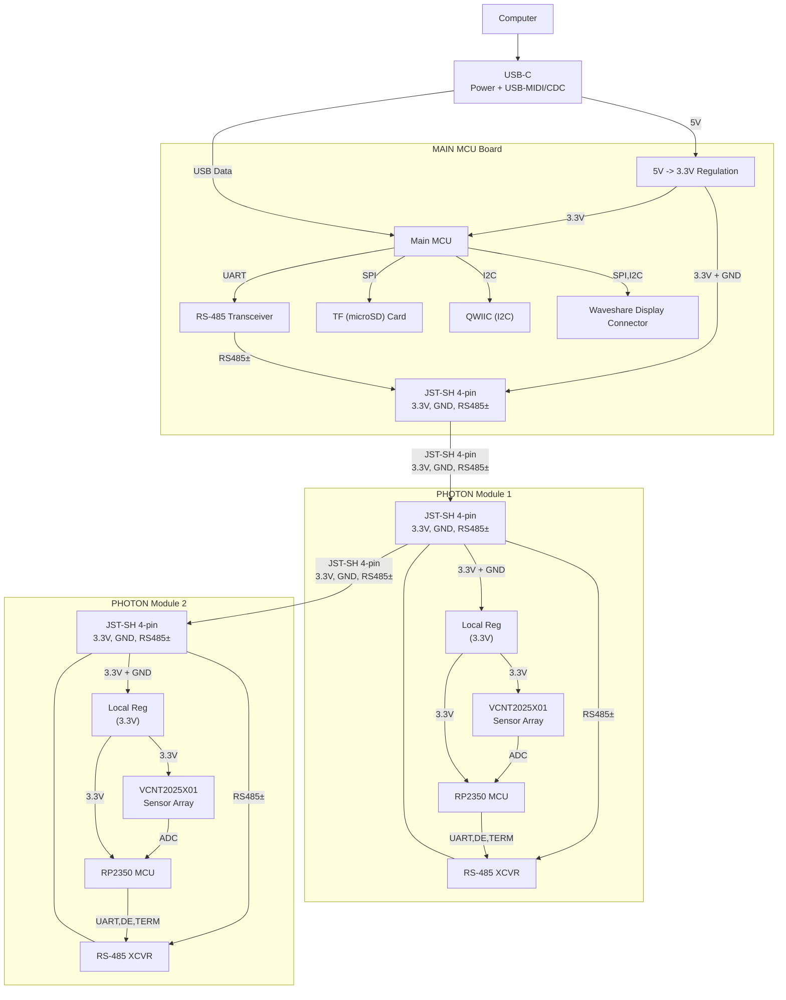
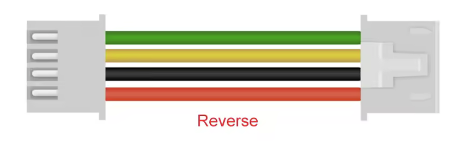

# PHOTON  
**PHysical Optical Tracking of Notes system**  
PHOTON is designed to make high-speed, contactless key tracking accessible for researchers, instrument builders, and tinkerers—without requiring custom hardware for every experiment.

Read the full paper published at TBD. 

## Citation

```bibtex
@article{photon2025,
  title   = {PHOTON: PHysical Optical Tracking of Notes},
  author  = {Anonymous},
  journal = {TBD},
  year    = {2025},
  doi     = {TBD},
}
```

## Overview

**PHOTON** is an open-source, modular optical sensing platform for high-resolution key and motion tracking. Each module integrates a KiCad-designed linear array of **VCNT2025X01 reflective sensors** with a Raspberry Pi **RP2350** microcontroller for fast, flexible data capture.

Modules can operate as **standalone USB-C devices**—streaming MIDI or raw sensor data—or link together in a **daisy-chained network** to form larger sensing surfaces. Firmware is written in **[CircuitPython](https://circuitpython.org)**. 
### Key Features  
**Hardware**
- Linear array of [VCNT2025X01](https://www.vishay.com/en/product/84895/) reflective sensors  
- [RP2350](https://www.raspberrypi.com/products/rp2350/) dual-core MCU with native USB 2.0  
- USB-C for power, data, and MIDI  
- ESD-protected power and I/O  
- Low Profile Design
- Low power consumption less than 0.4W (800mA @ 5V) per sensor board. 


**Connectivity**
- [QWIIC / I²C expansion](https://www.sparkfun.com/qwiic) for peripherals and chaining  
- UART-based RS485 daisy-chain interface for multi-module systems. Error-free high-speed communication across several meters.
- Enumerates as a USB-MIDI or USB-CDC device on any host  

**Openness**
- Firmware in [CircuitPython](https://circuitpython.org) (simple to modify and re-flash)  
- Fully open hardware (KiCad 9) and open firmware  

### Use Cases
PHOTON enables **contactless, high-resolution sensing** for musical instruments, robotics, laboratory setups, and other motion-tracking applications.

The device can function as a high resolution distance measurement of a single sensor at 1 kHz or a full 64-sensor scan at 100Hz. This allows ample room to conduct high resolution key movement studies. Custom MIDI interfaces can be developed for various instruments in a non-invasive way and the CircuitPython code means that the mechanisms are fully controllable by the user. This is in contrast to a typical MIDI keyboard which uses two switches and therefore no changable strike point.

---

# Hardware Overview


```mermaid
flowchart TB

  %% =========================
  %% HOST & MAIN CONTROLLER
  %% =========================

  PC["Computer"]
  USB["USB-C<br/>Power + USB-MIDI/CDC"]

  subgraph MAIN["MAIN MCU Board"]
    MAIN_MCU["Main MCU"]
    MAIN_REG["5V -> 3.3V Regulation"]
    JST_MAIN["JST-SH 4-pin<br/>3.3V, GND, RS485±"]
    RS485A["RS-485 Transceiver"]
    SD["TF (microSD) Card"]
    QWIIC["QWIIC (I2C)"]
    DISP["Waveshare Display Connector"]
  end

  PC --> USB
  USB -- "USB Data" --> MAIN_MCU
  USB -- "5V" --> MAIN_REG
  MAIN_REG -- "3.3V" --> MAIN_MCU

  MAIN_REG -- "3.3V + GND" --> JST_MAIN
  MAIN_MCU -- "UART" --> RS485A
  RS485A -- "RS485±" --> JST_MAIN
  MAIN_MCU -- "SPI" --> SD
  MAIN_MCU -- "I2C" --> QWIIC
  MAIN_MCU -- "SPI,I2C" --> DISP

  %% =========================
  %% PHOTON MODULE 1
  %% =========================

  subgraph P1["PHOTON Module 1"]
    JST1["JST-SH 4-pin<br/>3.3V, GND, RS485±"]
    RS485_1["RS-485 XCVR"]
    REG1["Local Reg<br/>(3.3V)"]
    RP1["RP2350 MCU"]
    A1["VCNT2025X01<br/>Sensor Array"]
  end

  %% =========================
  %% PHOTON MODULE 2
  %% =========================

  subgraph P2["PHOTON Module 2"]
    JST2["JST-SH 4-pin<br/>3.3V, GND, RS485±"]
    RS485_2["RS-485 XCVR"]
    REG2["Local Reg<br/>(3.3V)"]
    RP2["RP2350 MCU"]
    A2["VCNT2025X01<br/>Sensor Array"]
  end

  %% =========================
  %% SINGLE JST-4PIN DAISY CHAIN
  %% (3.3V, GND, RS485+, RS485-)
  %% =========================

  JST_MAIN -->|JST-SH 4-pin<br/>3.3V, GND, RS485±| JST1
  JST1 -->|JST-SH 4-pin<br/>3.3V, GND, RS485±| JST2

  %% Force physical adjacency of JST and RS-485 on each board
  JST1 --- RS485_1
  JST2 --- RS485_2

  %% =========================
  %% BREAKOUT INSIDE EACH MODULE
  %% =========================

  JST1 -- "3.3V + GND" --> REG1
  JST1 -- "RS485±" --> RS485_1

  JST2 -- "3.3V + GND" --> REG2
  JST2 -- "RS485±" --> RS485_2

  %% =========================
  %% LOCAL POWER & SIGNALING
  %% =========================

  REG1 -- "3.3V" --> RP1
  REG1 -- "3.3V" --> A1
  A1 -- "ADC" --> RP1
  REG2 -- "3.3V" --> RP2
  REG2 -- "3.3V" --> A2
  A2 -- "ADC" --> RP2

  %% =========================
  %% DATA FLOW UPSTREAM
  %% =========================

  RP1 -- "UART,DE,TERM" --> RS485_1
  RP2 -- "UART,DE,TERM" --> RS485_2
```

---

## Architecture  

### Hardware

Each PHOTON module contains:  
- A **linear VCNT2025X01 reflective sensor array**  
- An **RP2350** microcontroller with onboard flash (8MB)
- **USB-C** (for firmware update) and 4-pin **JST-SH** connectors for RS-485 
- Onboard regulation from **5 V → 3.3 V**  

#### Sensor Array  
A Ki-Cad 9 Plugin is provided to create a sensor board that is both manufacturable and appropriate for the user. This plugin allows the user to define the "pitch" (inter-center distance) of each sensing point, and the number of sensors. Moreover, as it is typical to have a sensing surface that requires an odd-number of sensors, a perforated "last sensor" area is available for removal after manufacturing.  **Note**: All designs must be verified before ordering.

Each sensor is connected to an enable line, via an N-FET transistor. This way, it only uses power when it is being sampled. Moreover, the sensor is sampled using the internal ADC on the RP2350 chip, allowing a very small power consumption. By sampling with the internal ADC, a significant amount of precision can be read from a small travel distance.

  ##### Reflective Sensing Principle  


The VCNT2025X01 emits infrared light toward a moving surface (e.g., a piano key). The reflected intensity, sampled by the ADC, provides a continuous estimate of position at rates up to ~100 Hz. The RP2350 processes these signals and outputs MIDI or control data over USB.


#### Technology Stack  
- **Optical sensing:** VCNT2025X01  
- **MCU:** RP2350 (dual-core Cortex-M33)  
- **Firmware:** CircuitPython or C SDK  
- **Mechanical:** 2-layer PCB; ~\$50 per fully assembled sensor board, $15 per fully assmelbed main board
- **Inter-board Interface:** RS-485 enables longer-distance **differential** communication from a main device to many other devices. The bus must be terminated at the end points of the bus. The [TI THVD1424](https://www.ti.com/lit/ds/symlink/thvd1424.pdf?ts=1764579397242) RS485 controller offers a programmable termination resistor that is controllable in the RP2350 firmware. The individual sensor boards also offer solder-bridge (cut-able with a razor blade/xacto knife) jumpers on the far side of the board, so that the long sensor boards can be terminated on either end. 


### Firmware / Software  
- **Signal path:** Samples analog output from each VCNT2025X01 via the RP2350 ADC, processes values in real time, and exports them as MIDI CC messages or raw USB serial data.  
- **Host integration:** Enumerates as a USB-MIDI device compatible with any DAW, Max/MSP patch, or custom Python client.  
- **Protocols:** USB-MIDI (default)
- **Language:** CircuitPython 10.x (RP2350-compatible).  
- **Related repo:** Forked CircuitPython with RP2350 PSRAM board definitions and RS-485 driver: https://github.com/w4iei/klavecimbelcircuitpython

### Firmware / Mechanism of Operation
The goal is to keep the software as approachable and editable as possible, so the project is primarily written in CircuitPython. However, CircuitPython alone cannot meet the lowest-latency requirements, so the RS-485 data path is implemented in C as a native module to keep bus timing tight and reduce latency and jitter.

#### Design Goals
- **Low-latency note onset detection:** target <2 ms response time for MIDI-style note-on.
- **High-resolution motion capture:** ~100 Hz tracking of key movement, where latency is less critical but bandwidth and memory are.

#### Communication Modes
**1) Host-polled scan (baseline / debugging)**  
The host requests the latest value of all sensors. This is simple and useful for debugging, but too slow for real-time response:
- A 64-sensor scan is ~100 Hz on the device (ADC scan time dominates), so the practical limit is ~100 full polls per second even at 4 Mbps.
- For a 2 ms response time you would need ~500 full polls per second, and for two manuals (128 sensors) even more.

**2) Event-based sensor notifications (low-latency)**  
After configuration, each sensor node can transmit a *sensor event* without being polled:
- Event payload: sensor index, note on/off state, velocity, and a sequence number.
- The host acknowledges each event; if no ACK arrives within a short window (target <1 ms), the node retries.
- Because RS-485 is multi-drop and collision detection is limited, nodes use a tiny randomized backoff before retrying.

#### Host Configuration / Calibration
The host provides the per-sensor parameters needed for event detection:
- Initial max and min of the sensor range.
- Polarity mode (default: low ADC value = off, higher values = note-on).
- Note-on strike point as a percentage between min and max.

Each sensor board maintains a running min/max of observed values and can report these on request.

#### High-Resolution Motion Capture Buffer
Each sensor board maintains a dedicated buffer for short, high-resolution key-motion captures:
- Default size: 2 bytes * 10 keys * 10 s * 100 Hz = 10,000 bytes (~20 kB).
- Buffers are assigned dynamically to active keys and refreshed about once per second once a key exceeds a small activation threshold (e.g., ~3% of its range).
- Keys above the threshold are scanned more frequently between full-bank scans to improve response time, but buffer writes are still capped at 100 Hz via per-key counters or a fixed timebase.
- If more keys are active than buffer slots, extra keys are dropped; the device should not crash or block.


---

## Getting Started  

### Requirements  

**Hardware:**  
- PHOTON module(s)  
- USB-C cable  
- JST-SH 4-Pin Cables, specifically: 1.0mm pitch, 4-PIN, "Reverse/Opposite Direction" heads, which makes Pin 1 of board A always align with Pin 1 of board B. Note: these cables are mechanically and electrically identical to QWIIC cables. 


**Software:**  
- CircuitPython UF2 for RP2350  
- A DAW or MIDI viewer (Pianoteq, Ableton Live, Reaper, Max/MSP, etc.)  

### Build & Flashing  

1. Hold the **USB-BOOT** button and connect the board via USB-C.  
2. Copy the latest CircuitPython `.uf2` for **Raspberry Pi Pico 2** to the mounted drive.  
   - Included in this repository under `resources/` (link TBD).  
   - More details here: https://learn.adafruit.com/welcome-to-circuitpython/installing-circuitpython (use the custom build above for RS-485 driver + PSRAM support).  
3. After reboot, copy your `code.py` and any libraries directly to the CIRCUITPY drive.  

CircuitPython runs entirely on-device; updating or modifying the firmware is as simple as replacing `code.py`.

### Debugging

Debugging is primarily done over the USB serial REPL.  
Use `print()`-style logging for diagnostics, but be aware that heavy serial output may impact timing performance.

The unpopulated JTAG header can be used for debugging **CircuitPython itself**, but not for stepping through user Python code.
