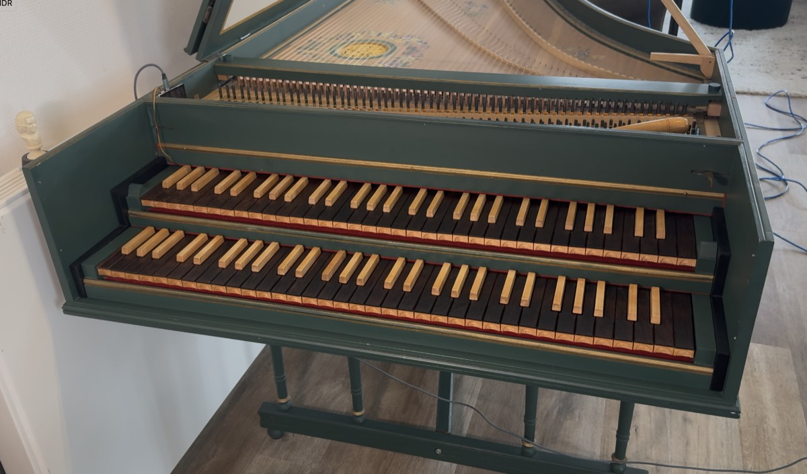

# PHOTON
**PHysical Optical Tracking of Notes system**

PHOTON is a modular, open-source optical sensing platform for high-resolution key and motion tracking. Each module combines a KiCad-designed linear array of **VCNT2025X01** reflective sensors, **TLA2518** high-speed SPI ADCs, and an **RP2350** MCU. Modules can run standalone over USB-C or daisy-chain over RS-485 for large sensing surfaces.

## Paper
[PHOTON: Non-Invasive Optical Tracking of Key-Lever Motion in Historical Keyboard Instruments](https://arxiv.org/abs/2604.21682) (arXiv:2604.21682)

## Demo
<a href="https://www.youtube.com/playlist?list=PLzCRAfVYuoWGEnWNO6l8IuFvaSUI3v1Gd">
  
</a>

[Watch the PHOTON demo playlist on YouTube](https://www.youtube.com/playlist?list=PLzCRAfVYuoWGEnWNO6l8IuFvaSUI3v1Gd)

## Highlights
- **Sensors:** [VCNT2025X01](https://www.vishay.com/en/product/84895/) reflective array with per-sensor enable lines
- **Digitization:** [TLA2518](https://www.ti.com/product/TLA2518) SPI ADCs for high-speed readout
- **MCU:** [RP2350](https://www.raspberrypi.com/products/rp2350/) (dual-core Cortex-M33)
- **Comms:** [THVD1424](https://www.ti.com/product/THVD1424) RS-485 transceivers; firmware-controlled termination on the main board (idle-bus failsafe via the transceiver's internal receiver thresholds on this hardware rev)
- **I/O:** USB-C (power + USB-MIDI/CDC), QWIIC/I2C expansion
- **Black box:** a microSD card in the bridge records every performance as Standard MIDI Files, host or no host (see [firmware/README.md](firmware/README.md#microsd-recorder-bridge))
- **Open:** KiCad 9 hardware, native C firmware (Pico SDK)

## Performance
- Full 31-sensor board sweep in ~770 µs — ~1.3 kHz open-loop; production runs two-phase, pace-throttled at 600 Hz (half the peak emitter current, 1.67 ms velocity quantisation) with µs-resolution velocity timing either way
- RS-485 bus at 4 Mbaud, bridge-polled: zero collisions by construction, zero event loss across ~500k sequence-accounted bench events, sub-ms worst-case event latency with four boards on the bus

## Firmware (native C, dual-core)
CircuitPython support is gone: it capped the system at a ~250 Hz single-core scan loop and could not prevent bus collisions, so it was retired for performance. The native Pico-SDK firmware ships as **one UF2 for every board** — each board probes its own hardware at boot and becomes a sensor node or the main bridge automatically:
- **Core 1** owns the sensor array: pipelined TLA2518 scanning, running entirely from SRAM so flash and USB activity can never stall a sweep.
- **Core 0** owns everything else: USB (CDC console + USB-MIDI), the RS-485 protocol, calibration and configuration storage.
- **RS-485:** the main board is the sole bus master and polls each sensor board in turn; nodes never transmit unsolicited, and every event batch is acknowledged before a node releases it — collision-free and lossless by design.
- **Scanning:** free-runs open-loop at ~1.3 kHz; throttled to a paced 600 Hz (two-phase mode) for production use.
- **microSD recorder:** a card in the bridge records every performance automatically as Standard MIDI Files, numbered per power-on and per playing episode, with no host, no setup and no clock required.

Legacy CircuitPython sources remain under `software/embedded_software/` as a reference implementation. Build and flash instructions: `firmware/README.md`.

## Architecture (Short)
- Sensor boards: VCNT2025X01 array -> TLA2518 SPI ADCs -> RP2350
- Main board: RP2350 + THVD1424 RS-485 + bias resistors + termination control
- Bus: RS-485 differential, terminated at endpoints

## Hardware
See `hardware/README.md` for board-specific notes and layout sources.

## Getting Started
**Hardware**
- PHOTON module(s)
- USB-C cable
- JST-SH 4-pin cables (1.0 mm pitch, reverse/opposite direction; QWIIC-compatible)

**Software**
- PHOTON firmware UF2 (build from `firmware/`, see `firmware/README.md`)
- KiCad 9 (download: https://www.kicad.org/download/)
- DAW or MIDI viewer (Pianoteq, Ableton Live, Reaper, Max/MSP, etc.)

## Build & Flash
1. Hold **USB-BOOT** (or short the USB-BOOT jumper) and connect via USB-C; copy `photon.uf2` to the mounted `RP2350` drive. The same image runs every board.
2. On each sensor board, set its bus id once via the USB console (`setid N`), then calibrate (`r`, play every key, `s`). Calibration and configuration persist in flash.
3. Boards already running PHOTON reflash over USB alone: the `bootsel` console command enters the bootloader without touching the button.

## Notes
- **Double-manual harpsichords** run on a single bus: each manual is a pair of sensor boards mapped to its own MIDI channel (`chmap` console command). The polled protocol eliminates inter-board collisions, so simultaneous playing on both manuals loses nothing.

## Citation
```bibtex
@inproceedings{photon2026,
  title       = {PHOTON: Non-Invasive Optical Tracking of Key-Lever Motion in Historical Keyboard Instruments},
  author      = {Noah Jaffe and John Ashley Burgoyne},
  booktitle   = {Proceedings of the 2026 International Conference on New Interfaces for Musical Expression (NIME)},
  year        = {2026},
  address     = {London, UK},
  note        = {23--26 June 2026. Preprint: arXiv:2604.21682},
  url         = {https://arxiv.org/abs/2604.21682},
}
```
